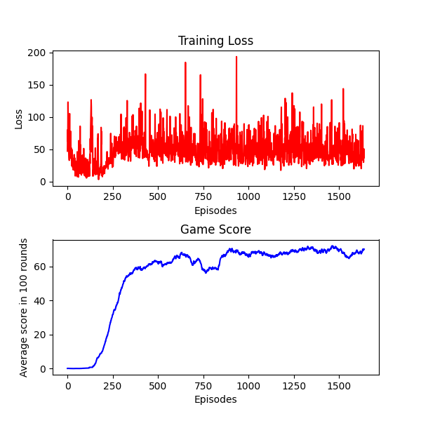
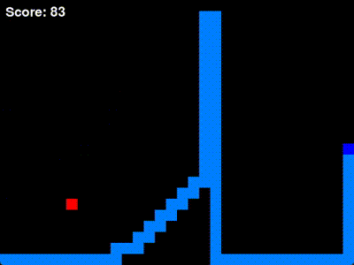

# 🐍 Snake Game
This repository contains a Python implementation of the classic Snake Game, where the snake is trained using Reinforcement Learning with the Deep Q-Learning algorithm. The project showcases how artificial intelligence can learn to navigate and optimize its gameplay using neural networks and a reward-based learning framework.

# 🧠 Algorithm
Deep Q-Learning (DQL) is a reinforcement learning algorithm that combines Q-Learning with deep neural networks. The agent learns to predict the Q-value of state-action pairs using experience replay and target networks.The AI agent uses Deep Q-Learning to make decisions. Through training, the agent learns from its past actions using a neural network that approximates the optimal Q-values for the game state-action pairs.

# 📂 File Structure:
```
|── GIF/ # plots and gifs
|
├── agent/
│ ├── base_agent.py # The base agent class
│ ├── mlp_agent.py # The agent using MLP and DQN
│ ├── cnn_agent.py # The agent using CNN and DQN
│ ├── greedy_agent.py # A simple agent that runs directly towards food
│ └── play_game_with_agent.py # Reward func, play func, play and learn func
│
├── common/
│ ├── settings.py # Hyperparameters, game size, and game speed
│ └── utils.py # Helper functions
│
├── game/
│ ├── game_display.py # Game display
│ ├── game_logic.py # Game logic
│ ├── main_game.py # Integrates game_display and game_logic
│ └── states.py # Game state
│
├── model/
│ ├── weights/
│ │ └── mlp_model.pth # Model weights
│ │ └── cnn_model.pth # Model weights
│ └── dqn_model.py # Neural networks
│
|── main.py # Main program, primarily contains user interaction
```
# 👾 Game Structure:
   ``` 
    Start
    │
    └─── Choose agent type
        │
        ├─── (a) MLP Agent
        │
        └─── (b) CNN Agent
            │
            └─── Choose mode
                │
                ├─── (a) Play
                │   │
                │   └─── Load previous model
                │       │
                │       ├─── Success
                │       │   └─── Play with loaded model
                │       │
                │       └─── Fail
                │           │
                │           └─── Continue without loaded model?
                │               │
                │               ├─── (a) Return to mode selection
                │               │
                │               └─── (b) Play with untrained model
                │
                └─── (b) Learn and Play
                    │
                    └─── Start training from scratch?
                        │
                        ├─── (a) Load previous model
                        │   │
                        │   ├─── Success
                        │   │   └─── Play and learn with loaded model
                        │   │
                        │   └─── Fail
                        │       │
                        │       └─── Continue without loaded model?
                        │           │
                        │           ├─── (a) Return to mode selection 
                        │           │
                        │           └─── (b) Training from scratch
                        │
                        └─── (b) Start new training
    ```
# 📹 Demo



